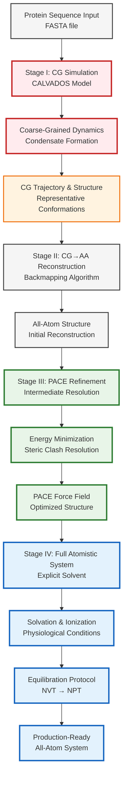

# Multiscale Simulation Workflow: From Coarse-Grained to All-Atom Protein Condensates

## Abstract Workflow Overview

The **Multiscale² (MS²)** framework provides an automated pipeline for transitioning protein condensate simulations from coarse-grained (CG) representations through intermediate PACE models to fully atomistic systems in explicit solvent.

## Core Methodology Flowchart

## Multiscale Resolution Hierarchy

### Stage I: Coarse-Grained Foundation (CALVADOS)
- **Resolution**: ~10 Å per bead
- **Timescale**: Microseconds to milliseconds  
- **Purpose**: Capture long-range condensate formation dynamics
- **Output**: Equilibrated condensate conformations

### Stage II: Structural Reconstruction (Backmapping)
- **Method**: CG2ALL algorithm
- **Function**: Atomistic coordinate assignment from CG beads
- **Validation**: Geometric consistency and steric feasibility
- **Output**: Initial all-atom structures

### Stage III: Intermediate Refinement (PACE)
- **Resolution**: Coarse-grained backbone, atomistic sidechains
- **Force Field**: PACE (Protein Alchemical Coarse-grained Ensemble)
- **Optimization**: Energy minimization with restraints
- **Purpose**: Bridge CG and AA representations

### Stage IV: Full Atomistic System (All-Atom MD)
- **Resolution**: Complete atomic detail
- **Environment**: Explicit solvent with physiological ionic strength
- **Equilibration**: Multi-stage thermal and pressure equilibration
- **Outcome**: Production-ready MD system

## Key Algorithmic Innovations

1. **Automated Workflow Generation**: Template-based script generation for reproducible simulations
2. **Adaptive Resolution Scaling**: Intelligent parameter adjustment across resolution scales  
3. **Error-Resilient Processing**: Automatic retry mechanisms for energy minimization failures
4. **GPU-Accelerated Equilibration**: High-performance computing integration

## Validation Metrics

- **Structural Fidelity**: RMSD comparison across resolution transitions
- **Thermodynamic Consistency**: Energy conservation and system stability
- **Dynamic Properties**: Diffusion coefficients and relaxation timescales
- **Condensate Characteristics**: Density profiles and phase behavior

## Computational Efficiency

| Stage | Typical Runtime | Computational Demand | Scalability |
|-------|----------------|---------------------|-------------|
| CG Simulation | Hours to Days | Low-Medium | Excellent |
| Backmapping | Minutes | Low | Linear |
| PACE Refinement | Hours | Medium | Good |
| AA Equilibration | Days | High | GPU-dependent |

## Applications and Scope

- **Intrinsically Disordered Proteins (IDPs)**: Stress granules, P-bodies
- **Membrane-Associated Condensates**: Nuclear speckles, nucleoli  
- **Multi-component Systems**: Protein-RNA condensates
- **Disease-Related Aggregates**: Pathological protein assemblies

## Technical Requirements

- **Software Dependencies**: CALVADOS, OpenMM, GROMACS, CG2ALL
- **Hardware**: Multi-core CPU, GPU acceleration recommended
- **Memory**: 16-64 GB RAM depending on system size
- **Storage**: 100 GB - 1 TB for trajectory data

This multiscale framework enables the systematic investigation of protein condensate formation and dynamics across biologically relevant length and time scales, bridging the gap between coarse-grained efficiency and atomistic accuracy.

